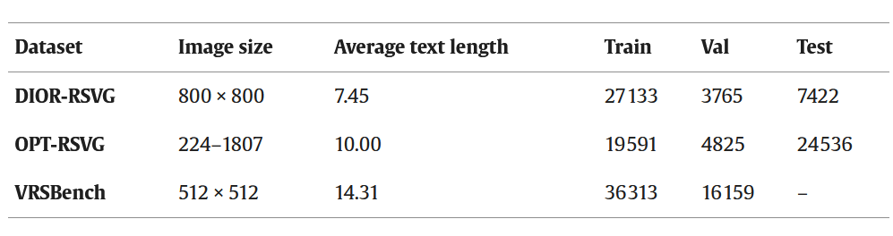

# Context-driven and Sparse Decoding for Remote Sensing Visual Grounding (CSDNet)

[](LICENSE)
[](https://www.python.org/)
[](https://pytorch.org)

#### Official PyTorch implementation of the paper published in Information Fusion:

**"Context-driven and Sparse Decoding for Remote Sensing Visual Grounding"**  
*Yichen Zhao, Yaxiong Chen, Ruilin Yao, Shengwu Xiong, Xiaoqiang Lu*  
*Information Fusion, Volume 123, 2025*

[📄 Paper](https://www.sciencedirect.com/science/article/pii/S1566253525003690#d1e1674) [🌐 Project Page](https://github.com/WUTCM-Lab/CSDNet) 


## 🚀 Overview
#### CSDNet is a novel framework for remote sensing visual grounding that features:
- A Context-driven Sparse Decoding Network (CSDNet) is proposed for RSVG, which enhances features by modeling multimodal context and performs cross-modal decoding using sparsely sampled visual features.
- A Text-aware Fusion Module (TFM) is proposed, which adaptively modulates visual features using textual cues aggregated from image context to enhance text-related semantic representations. In addition, a Context-enhanced Interaction Module (CIM) is proposed to harmonize modal differences by modeling multimodal contexts.
- A text-guided sparse decoder is developed to sparsely sample visual features and perform target object reasoning under text guidance.

## 📊 Supported Datasets
#### We provide support for three remote sensing visual grounding datasets:
{: width="70%"}

##### Dataset splits and annotations are organized in the `data/` directory:
```bash
data/
├── DIOR_RSVG/
│ ├── DIOR_RSVG_train.pth
│ ├── DIOR_RSVG_val.pth
│ └── DIOR_RSVG_test.pth
├── OPT_RSVG/
│ ├── OPT_RSVG_train.pth
│ ├── OPT_RSVG_val.pth
│ └── OPT_RSVG_test.pth
└── VRSBench_Ref/
├── VRSBench_Ref_train.pth
└── VRSBench_Ref_val.pth
```

## 🛠 Installation

#### 1. Clone this repository:
```bash
git https://github.com/WUTCM-Lab/CSDNet.git
cd CSDNet
```

#### 2. Install dependencies:
```bash
conda create -n csdnet python=3.8
conda activate csdnet
pip install -r requirements.txt
```

#### 3. Dataset Download & Loading
**(1) Download datasets** from this [Google Drive folder](https://drive.google.com/drive/folders/1o3V48IhgUDwzKeZaDYpMXa_bXX3O5JZh?usp=drive_link)

**(2) Folder structure**:
```bash
image_root
├── DIOR_RSVG/
└──── JPEGImages
├── OPT_RSVG/
└──── Image
├── VRSBench_Ref/
├──── Images_train
└──── Images_val
```

## 🏋️ Training
```bash
sh train.sh
```

## 🙏 Acknowledgments
##### We gratefully acknowledge the following foundational works that inspired and supported this research:
```bibtex
@article{DBLP:journals/tgrs/ZhanXY23,
  author       = {Yang Zhan and
                  Zhitong Xiong and
                  Yuan Yuan},
  title        = {{RSVG:} Exploring Data and Models for Visual Grounding on Remote Sensing
                  Data},
  journal      = {{IEEE} Trans. Geosci. Remote. Sens.},
  volume       = {61},
  pages        = {1--13},
  year         = {2023},
  url          = {https://doi.org/10.1109/TGRS.2023.3250471},
  doi          = {10.1109/TGRS.2023.3250471},
  timestamp    = {Mon, 22 Apr 2024 14:53:49 +0200},
  biburl       = {https://dblp.org/rec/journals/tgrs/ZhanXY23.bib},
  bibsource    = {dblp computer science bibliography, https://dblp.org}
}
```

```bibtex
@inproceedings{DBLP:conf/nips/LiDE24,
  author       = {Xiang Li and
                  Jian Ding and
                  Mohamed Elhoseiny},
  editor       = {Amir Globersons and
                  Lester Mackey and
                  Danielle Belgrave and
                  Angela Fan and
                  Ulrich Paquet and
                  Jakub M. Tomczak and
                  Cheng Zhang},
  title        = {VRSBench: {A} Versatile Vision-Language Benchmark Dataset for Remote
                  Sensing Image Understanding},
  booktitle    = {Advances in Neural Information Processing Systems 38: Annual Conference
                  on Neural Information Processing Systems 2024, NeurIPS 2024, Vancouver,
                  BC, Canada, December 10 - 15, 2024},
  year         = {2024},
  url          = {http://papers.nips.cc/paper\_files/paper/2024/hash/05b7f821234f66b78f99e7803fffa78a-Abstract-Datasets\_and\_Benchmarks\_Track.html},
  timestamp    = {Thu, 13 Feb 2025 16:56:42 +0100},
  biburl       = {https://dblp.org/rec/conf/nips/LiDE24.bib},
  bibsource    = {dblp computer science bibliography, https://dblp.org}
}
```

```bibtex
@article{DBLP:journals/tgrs/LiWXZW24,
  author       = {Ke Li and
                  Di Wang and
                  Haojie Xu and
                  Haodi Zhong and
                  Cong Wang},
  title        = {Language-Guided Progressive Attention for Visual Grounding in Remote
                  Sensing Images},
  journal      = {{IEEE} Trans. Geosci. Remote. Sens.},
  volume       = {62},
  pages        = {1--13},
  year         = {2024},
  url          = {https://doi.org/10.1109/TGRS.2024.3423663},
  doi          = {10.1109/TGRS.2024.3423663},
  timestamp    = {Wed, 11 Dec 2024 17:20:49 +0100},
  biburl       = {https://dblp.org/rec/journals/tgrs/LiWXZW24.bib},
  bibsource    = {dblp computer science bibliography, https://dblp.org}
}
```

```bibtex
@article{DBLP:journals/pami/ShiGHW24,
  author       = {Fengyuan Shi and
                  Ruopeng Gao and
                  Weilin Huang and
                  Limin Wang},
  title        = {Dynamic {MDETR:} {A} Dynamic Multimodal Transformer Decoder for Visual
                  Grounding},
  journal      = {{IEEE} Trans. Pattern Anal. Mach. Intell.},
  volume       = {46},
  number       = {2},
  pages        = {1181--1198},
  year         = {2024},
  url          = {https://doi.org/10.1109/TPAMI.2023.3328185},
  doi          = {10.1109/TPAMI.2023.3328185},
  timestamp    = {Thu, 11 Apr 2024 07:29:43 +0200},
  biburl       = {https://dblp.org/rec/journals/pami/ShiGHW24.bib},
  bibsource    = {dblp computer science bibliography, https://dblp.org}
}

```


## 📜 Citation
```bibtex
@article{DBLP:journals/inffus/ZhaoCYXL25,
  author       = {Yichen Zhao and
                  Yaxiong Chen and
                  Ruilin Yao and
                  Shengwu Xiong and
                  Xiaoqiang Lu},
  title        = {Context-driven and sparse decoding for Remote Sensing Visual Grounding},
  journal      = {Inf. Fusion},
  volume       = {123},
  pages        = {103296},
  year         = {2025},
  url          = {https://doi.org/10.1016/j.inffus.2025.103296},
  doi          = {10.1016/J.INFFUS.2025.103296}
}
```
